# Bastion: Trust-First Security for 1Password

Build verifiable trust: hardware entropy, air‑gapped keys, deterministic usernames, YubiKey orchestration, recovery‑chain governance, and estate‑grade backups — all anchored in 1Password.

A security toolkit for establishing verifiable trust from the ground up: hardware entropy collection, air-gapped secret generation, SLIP-39 key splitting with physical distribution, and 1Password-integrated credential lifecycle management.

> ⚠️ **Security Warning:** This software has NOT been independently audited or formally reviewed. It handles sensitive security data and is provided as-is. Use entirely at your own risk. See [LICENSE](LICENSE) for full disclaimer.

### Project Status

| Category | Badge | Description |
|----------|-------|-------------|
| **Release** | [](https://github.com/jakehertenstein/bastion/releases) | Latest version |
| **Maintenance** | [](https://github.com/jakehertenstein/bastion/commits/main) | Actively maintained |
| **Security** | [](#defense-in-depth) | Not yet independently audited |
| **Python** | [](https://www.python.org/downloads/) | Supported Python versions |
| **Integration** | [](https://developer.1password.com/docs/cli/) | Requires 1Password CLI v2 |
| **Linting** | [](https://github.com/astral-sh/ruff) | Code quality via Ruff |
| **License** | [](https://polyformproject.org/licenses/noncommercial/1.0.0/) | Non-commercial use only |
| **AI** | [](SECURITY.md#ai-assistance--verification) | CoPilot Assisted Development, Human Verified |

---

## Table of Contents

- [Bastion: Trust-First Security for 1Password](#bastion-trust-first-security-for-1password)
    - [Project Status](#project-status)
  - [Table of Contents](#table-of-contents)
  - [Problems Bastion Solves](#problems-bastion-solves)
  - [Ecosystem Overview](#ecosystem-overview)
    - [Package Summary](#package-summary)
    - [Features](#features)
  - [How It Works Together](#how-it-works-together)
  - [Where Bastion Fits](#where-bastion-fits)
  - [Architecture](#architecture)
    - [1Password as Source of Truth](#1password-as-source-of-truth)
  - [Defense in Depth](#defense-in-depth)
    - [Layer Details](#layer-details)
    - [Physical Security Layers](#physical-security-layers)
    - [Secure Coding Practices](#secure-coding-practices)
    - [Why Multiple Layers?](#why-multiple-layers)
  - [Digital Estate Management](#digital-estate-management)
    - [Recovery Bag Architecture](#recovery-bag-architecture)
    - [Backup \& Recovery](#backup--recovery)
    - [Chain of Trust](#chain-of-trust)
    - [Tamper Detection](#tamper-detection)
    - [Update Procedures](#update-procedures)
    - [Recovery Scenarios](#recovery-scenarios)
  - [Included Packages](#included-packages)
    - [bastion-security (Core CLI)](#bastion-security-core-cli)
    - [Seeder](#seeder)
    - [Airgap](#airgap)
    - [Core (Internal)](#core-internal)
  - [Requirements](#requirements)
  - [Platform Compatibility](#platform-compatibility)
  - [Installation](#installation)
    - [From PyPI](#from-pypi)
    - [From Source (Development)](#from-source-development)
  - [Getting Started](#getting-started)
    - [Terminal Demos](#terminal-demos)
    - [10-Minute Setup](#10-minute-setup)
    - [More Examples](#more-examples)
  - [Command Reference](#command-reference)
    - [Configuration](#configuration)
    - [Entropy Generation](#entropy-generation)
    - [Username Generation](#username-generation)
    - [1Password Operations (`bsec 1p`)](#1password-operations-bsec-1p)
      - [Sync \& Export](#sync--export)
      - [Reports \& Analysis](#reports--analysis)
      - [Security Checks](#security-checks)
      - [Auditing](#auditing)
      - [Tag Management](#tag-management)
      - [YubiKey Management](#yubikey-management)
      - [Account Relationships](#account-relationships)
      - [Maintenance](#maintenance)
  - [Documentation](#documentation)
  - [License](#license)
  - [Disclaimer](#disclaimer)

## Problems Bastion Solves

1) Hidden Recovery Chains (Gmail → AT&T → Bank)
- Problem: Email controls your AT&T account; AT&T controls your Bank’s 2FA. Attackers can pivot: email reset → SIM swap → bank takeover.
- Solution: Model and link dependencies in 1Password, harden root accounts (hardware 2FA, recovery settings), mitigate SIM‑swap exposure, and document recovery paths.
- Example: Link Gmail → AT&T and AT&T → Bank; enforce FIDO2 on Gmail; set Bank recovery to non‑SMS; record links so reviews flag cascade risk.

2) Estate‑Grade Recovery
- Problem: A single device or account loss can orphan keys or make recovery guesswork.
- Solution: Air‑gapped SLIP‑39 (3‑of‑5) master entropy and GPG keys, distributed recovery bags with tamper evidence and instructions.
- Example: Reconstruct master with 3 shares; verify timelines with Sigchain + OpenTimestamps; decrypt backups; restore devices without network.

3) Guaranteed Randomness
- Problem: OS RNG is opaque; single‑source failures taint secrets.
- Solution: Combine multiple hardware sources via XOR + SHAKE256; analyze pools. Critical key entropy stays air‑gapped; operational entropy is cataloged in 1Password.
- Example: Collect YubiKey + TRNG + dice for SLIP‑39/GPG (air‑gapped); separate pools for username derivation (stored in 1Password).

4) Unlinkable Usernames
- Problem: Reused usernames enable tracking across services.
- Solution: Deterministic HMAC‑based derivation per label/domain with auditable verification.
- Example: Generate `exchange.example` username once; regenerate or verify later without disclosure.

5) YubiKey OATH Orchestration
- Problem: Mirroring dozens of TOTP accounts to backup keys is tedious and error‑prone.
- Solution: Scan, cache, compare, batch‑sync slots; update 1Password device items.
- Example: Provision two backups to mirror the primary; rescan until slot parity matches.

6) Structured Ground Truth (Tags + Links)
- Problem: Inconsistent tagging and missing relationships hide capability and risk.
- Solution: Hierarchical `Bastion/*` tags for Type/Capability/2FA/Dependency/Security and bidirectional Related Items links.
- Example: Query “Money‑Transfer + weak 2FA” and see linked recovery parents (Gmail → AT&T → Bank).

## Ecosystem Overview

Bastion is a monorepo containing multiple specialized packages that work together:

```mermaid
flowchart LR
    subgraph Sources["Entropy Sources"]
        yk["🔑 YubiKey<br/>HMAC-SHA1"]
        inf["🎰 Infinite Noise<br/>TRNG"]
        dice["🎲 Physical Dice<br/>Manual"]
        sys["💻 System RNG<br/>/dev/urandom"]
    end

    subgraph Core["bastion-security"]
        entropy["🧩 Entropy Pool<br/>XOR + SHAKE256"]
        user["👤 Username Gen<br/>HMAC-SHA512"]
        rotate["🔄 Rotation Track<br/>Risk Tiers"]
        breach["🔍 Breach Check<br/>HIBP k-anon"]
        ykm["🔐 YubiKey Mgmt<br/>1P Sync"]
    end

    subgraph Storage["Storage"]
        op["☁️ 1Password<br/>Source of Truth"]
        cache["💾 Local Cache<br/>Fernet Encrypted"]
    end

    subgraph Packages["Companion Packages"]
        seeder["🃏 Seeder<br/>Seed Cards"]
        airgap["✈️ Airgap<br/>SLIP-39 + GPG"]
    end

    Sources --> entropy
    entropy --> user
    entropy --> seeder
    entropy --> airgap
    
    op <--> cache
    cache --> rotate
    cache --> breach
    cache --> ykm
```



### Package Summary

| Package | Purpose | Install |
|---------|---------|---------|
| **bastion-security** | Core CLI: rotation tracking, usernames, entropy, YubiKey | `pip install bastion-security` |
| **seeder** | Deterministic seed cards for high‑entropy offline passwords; validated by entropy and attack‑cost analysis | `pip install -e packages/seeder` |
| **airgap** | Air-gapped key generation, SLIP-39 shares, GPG setup | `pip install -e packages/airgap` |
| **core** | Shared utilities: platform, hardware, and network detection | Used by other packages |

### Features

- **Estate & Air‑Gapped Foundations** — SLIP‑39 shares, GPG keys, and tamper‑evident recovery bags
- **Dependency & Recovery Chain Governance** — Model and link account recovery paths to reduce cascade risk
- **Guaranteed Entropy Generation** — Collect, combine, and analyze hardware entropy sources
- **Deterministic Username Privacy** — Unlinkable, reproducible usernames per service
- **YubiKey OATH Management** — Scan, mirror, and audit OATH slots across backup keys
- **Tag Taxonomy** — Hierarchical `Bastion/*` tags: Type, Capability, 2FA, Dependency, Security
- **Related Items Linking** — Traceability between accounts, devices, and backups in 1Password
- **Seeder Offline Memory Aid** — Deterministic token grids for offline use without a manager

## How It Works Together

- Generate high‑assurance entropy → derive usernames and seed critical operations.
- Create the account → apply `Bastion/*` tags → link recovery parents/children.
- Provision YubiKeys → mirror OATH slots to backups → update device items.
- Review dependency risk regularly → avoid SIM‑based recovery paths where possible.
- Establish estate artifacts (SLIP‑39, GPG, instructions) → distribute recovery bags; anchor events via Sigchain + OpenTimestamps.

## Where Bastion Fits

- **1Password**: Source of truth and secure storage.
- **Watchtower**: Item‑level alerts and hygiene (breach notifications, reuse, weak passwords).
- **Bastion**: System‑level governance across entropy, identities, devices, dependencies, and recovery.
- **Airgap**: Offline generation for catastrophic‑risk assets (SLIP‑39, GPG).
- **Seeder**: High‑entropy offline passwords without a password manager; outcome validated by entropy and attack‑cost analysis.

## Architecture

### 1Password as Source of Truth

Bastion uses 1Password as the **single source of truth** for all credential and device data. The local encrypted cache is a performance optimization—1Password vault is always authoritative.

**Why cache?** The 1Password CLI (`op`) is powerful but slow. Each `op item get` call takes 200-500ms. A status report touching 1000+ items would take 5-10 minutes. Bastion syncs once, caches locally with Fernet encryption, and queries complete in milliseconds.

**Security model:**
- Cache encryption key stored in 1Password vault (never on disk unprotected)
- Cache file (`~/.bsec/cache/db.enc`) is encrypted at rest
- Cache is read-only—all writes go to 1Password first
- Stale cache is always safe (just re-sync)


**YubiKey Management:**
- YubiKey devices tracked via items with `YubiKey/Token/*` tags in 1Password
- Each YubiKey has a Secure Note with SN field and OATH slot sections
- Commands compare physical hardware with 1Password data
- Updates flow: hardware scan → 1Password (never reverse)

## Defense in Depth

Bastion implements **overlapping security layers** where compromise of one layer doesn't compromise overall security. Each layer addresses different threat vectors, and layers reinforce each other.


### Layer Details

| Layer | Threat Addressed | Implementation |
|-------|------------------|----------------|
| **Hardware Entropy** | Weak RNG, predictable seeds | YubiKey HMAC + Infinite Noise TRNG + dice + system RNG combined via XOR |
| **Username Privacy** | Cross-service tracking, profile correlation | HMAC-SHA512 deterministic generation, per-service unique |
| **Credential Hygiene** | Stale passwords, unknown breach exposure | Risk-tiered rotation schedules (30-180 days based on criticality) |
| **2FA Analysis** | Software 2FA vulnerabilities, weakest-link attacks | Hardware FIDO2 > Software FIDO2 > TOTP > Push > SMS weakness ranking |
| **Breach Detection** | Credential stuffing, unknown compromise | HIBP k-anonymity (hash prefix only, passwords never leave machine) |
| **Dependency Mapping** | Account cascade attacks, hidden recovery chains | Graph analysis: `Gmail → GitHub → AWS` shows reset paths |
| **Secure Storage** | Local cache theft, disk forensics | Fernet (AES-128-CBC + HMAC-SHA256), key stored in 1Password vault |
| **Audit Trail** | Repudiation, unauthorized changes | Keybase-style sigchain with hash-linked events |
| **Bitcoin Anchoring** | Timestamp forgery, log tampering | OpenTimestamps Merkle root anchoring via multiple calendar servers |

### Physical Security Layers

| Layer | Purpose | Implementation |
|-------|---------|----------------|
| **YubiKey Redundancy** | Hardware key loss | Primary + backup keys, TOTP slot sync, migration tools |
| **Air-Gapped Generation** | Network-based attacks | Offline key generation, QR code transfer |
| **SLIP-39 Distribution** | Catastrophic loss, estate planning | 3-of-5 threshold shares across geographic locations |
| **Seed Cards** | Device loss, memory backup | Credit-card-sized physical cards with Argon2id-stretched tokens |
| **Tamper-Evident Storage** | Physical compromise detection | Glitter nail polish on hardware, serialized tamper seals |

### Secure Coding Practices

| Practice | Implementation |
|----------|---------------|
| **No shell injection** | All subprocess calls use argument lists, never `shell=True` |
| **No dynamic execution** | No `eval()` or `exec()` |
| **Atomic writes** | Temp file + rename prevents partial writes |
| **Restrictive permissions** | 0o600 for files, 0o700 for directories |
| **Input sanitization** | All 1Password CLI arguments validated |

### Why Multiple Layers?

1. **No single point of failure** — YubiKey loss doesn't lock you out (SLIP-39 recovery)
2. **Detection + Prevention** — Breach monitoring catches what strong passwords miss
3. **Hardware supplements software** — TRNG ensures entropy even if OS RNG is compromised
4. **Forensics capability** — Sigchain + OTS enables post-incident analysis
5. **Geographic distribution** — SLIP-39 shares survive localized disasters
6. **Tamper evidence** — Physical seals and Bitcoin anchoring reveal unauthorized access

## Digital Estate Management

Bastion includes comprehensive planning for digital estate management—ensuring your security infrastructure survives you and remains accessible to trusted parties.

Events related to estate artifacts are hash‑linked in a Sigchain and timestamp‑anchored via OpenTimestamps for post‑incident verification. See [docs/SIGCHAIN-GUIDE.md](docs/SIGCHAIN-GUIDE.md) and [docs/ESTATE-VERSION-CONTROL.md](docs/ESTATE-VERSION-CONTROL.md) for end‑to‑end procedures and verification.

### Recovery Bag Architecture

Each of the 5 geographic locations receives an identical **tamper-evident recovery bag** containing:

| Component | Purpose | Format |
|-----------|---------|--------|
| **SLIP-39 Share** | 1 of 5 Shamir shares (3 required for recovery) | Cryptosteel Capsule (fireproof, tamper-sealed) |
| **1Password Emergency Kit** | Account recovery credentials | Laminated paper in sealed envelope |
| **µSD: Air-Gap Live Image** | Bootable OS for offline operations | Tails/similar, write-protected |
| **µSD: Encrypted Backup** | GPG-encrypted vault export | LUKS + GPG, requires passphrase |
| **µSD: Audit Log** | Sigchain + OpenTimestamps proofs | Signed, timestamped event history |
| **Tamper Seals** | Evidence of unauthorized access | Numbered seals + glitter nail polish on hardware |
| **Recovery Instructions** | Step-by-step restoration guide | Laminated, assumes no prior knowledge |

### Backup & Recovery

| Component | Strategy | Location |
|-----------|----------|----------|
| **Master Entropy** | SLIP-39 Shamir shares (3-of-5 threshold) | 5 recovery bags at geographic locations |
| **Username Salt** | Generated from RNG, stored in 1Password | Recoverable via 1Password Emergency Kit |
| **YubiKey Secrets** | Redundant across 3+ YubiKeys | Primary carry + secure backups |
| **Seed Cards** | Credit-card-sized physical cards with Argon2id tokens | Included in recovery bags |
| **1Password Account** | Emergency Kit in each recovery bag | 5 copies across all locations |

### Chain of Trust

```mermaid
flowchart TD
    subgraph Airgap["✈️ Air-Gapped Environment"]
        subgraph Sources["Entropy Sources"]
            dice["🎲 Physical Dice"]
            yk["🔑 YubiKey HMAC"]
            trng["🎰 Infinite Noise"]
            sys["💻 System RNG"]
        end
        
        subgraph Generation["🔐 Generation"]
            dice --> entropy["XOR + SHAKE256<br/>Master Entropy"]
            yk --> entropy
            trng --> entropy
            sys --> entropy
            entropy --> salt["Username Salt"]
            entropy --> slip39["SLIP-39 Split"]
            entropy --> gpg["GPG Keys"]
        end
    end
    
    subgraph Distribution["📦 Physical Distribution"]
        slip39 --> share1["🏠 Home Safe"]
        slip39 --> share2["🏦 Safety Deposit"]
        slip39 --> share3["⚖️ Attorney"]
        slip39 --> share4["👨‍👩‍👧 Family"]
        slip39 --> share5["🤝 Trusted Friend"]
    end
    
    subgraph Verification["✅ Tamper Evidence"]
        sigchain["Sigchain"] --> ots["OpenTimestamps"]
        ots --> bitcoin["₿ Bitcoin"]
        seals["🔒 Physical Seals"]
    end
    
    Airgap --> Distribution
    Airgap --> Verification
```



### Tamper Detection

| Mechanism | What It Detects | How |
|-----------|-----------------|-----|
| **Sigchain Verification** | Unauthorized events, log tampering | Hash chain breaks if any event modified |
| **OpenTimestamps** | Backdated entries, timeline manipulation | Bitcoin anchoring proves existence at time |
| **Physical Seals** | Hardware access, bag opening | Glitter nail polish, numbered tamper seals |
| **SLIP-39 Checksums** | Share corruption, transcription errors | Built-in error detection in share format |

### Update Procedures

| Event | Required Actions |
|-------|------------------|
| **New Critical Account** | Tag in 1Password → Re-sync → Update rotation schedule |
| **YubiKey Replacement** | Sync OATH slots → Update 1Password item → Retire old key |
| **Salt Rotation** | Generate new entropy → Update SLIP-39 shares → Re-generate usernames |
| **Breach Detected** | Run breach check → Rotate affected passwords → Tag for audit trail |
| **Estate Update** | Re-generate SLIP-39 → Distribute new shares → Anchor to Bitcoin |

### Recovery Scenarios

| Scenario | Recovery Path | Time Estimate |
|----------|--------------|---------------|
| **Lost YubiKey** | Backup YubiKey (identical OATH slots) | Immediate |
| **All YubiKeys Lost** | SLIP-39 share recovery (3 of 5 needed) | 1-2 days |
| **1Password Lockout** | Emergency Kit + family account | 1 hour |
| **Incapacitation** | Attorney + 2 family shares → full recovery | Per estate plan |

## Included Packages

### bastion-security (Core CLI)

The primary command-line interface for all security operations. Provides password rotation tracking, deterministic username generation, entropy management, and YubiKey synchronization.

```mermaid
flowchart LR
    subgraph Entropy["Entropy Sources"]
        yk["🔑 YubiKey"]
        trng["🎰 TRNG"]
        dice["🎲 Dice"]
        sys["💻 System"]
    end
    
    subgraph Processing["bsec CLI"]
        collect["Entropy<br/>Collection"]
        user["Username<br/>Generation"]
        sync["Vault<br/>Sync"]
        report["Risk<br/>Analysis"]
    end
    
    subgraph Storage
        op["☁️ 1Password"]
        cache["💾 Cache"]
    end
    
    subgraph Outputs
        csv["📊 Reports"]
    end
    
    yk --> collect
    trng --> collect
    dice --> collect
    sys --> collect
    collect --> user
    collect -->|"🧩 Pools"| op
    user -->|"👤 Usernames"| op
    op <--> sync <--> cache
    cache --> report --> csv
```



```bash
pip install bastion-security
bsec --help
```

**Key capabilities:**
- `bsec generate entropy` — Collect entropy from hardware sources
- `bsec generate username` — Create deterministic usernames
- `bsec 1p sync` — Sync 1Password vault to local cache
- `bsec 1p report` — Generate security status reports
- `bsec 1p yubikey` — Manage YubiKey devices

### Seeder

A secure, deterministic password token generator that creates 10×10 matrices of cryptographic tokens. Designed for air-gapped systems with strong emphasis on reproducibility and security.

```mermaid
flowchart LR
    subgraph Inputs
        phrase["📝 Passphrase"]
        salt["🧂 Salt"]
        coords["📍 Coordinates"]
    end
    
    subgraph Processing["Seeder"]
        argon["Argon2id<br/>Stretching"]
        derive["Token<br/>Derivation"]
        matrix["10×10<br/>Matrix"]
    end
    
    subgraph Outputs
        card["🃏 Seed Card"]
        pdf["📄 PDF"]
        tokens["🔐 Tokens"]
    end
    
    phrase --> argon
    salt --> argon
    argon --> derive --> matrix
    coords --> matrix
    matrix --> card
    matrix --> pdf
    matrix --> tokens
```



```bash
cd packages/seeder
pip install -e .
seeder generate grid --simple "my secure phrase"
```

**Example 10×10 Token Grid (Base90, 4-character tokens):**

Using the BIP-39 test vector `"abandon abandon abandon..."` with HMAC-based derivation:

```text
      A      B      C      D      E      F      G      H      I      J
   ┌──────┬──────┬──────┬──────┬──────┬──────┬──────┬──────┬──────┬──────┐
 0 │ P#qK │ ~+3m │ 7_w$ │ B@x! │ 9&z% │ M*yL │ 4/dE │ 6[oJ │ &N-T │ v*sP │
 1 │ Hq2R │ 5#kM │ 2(pQ │ l.uV │ 8}nW │ Y~gS │ 3;fX │ 1,bZ │ _-hA │ c?jD │
 2 │ 6+rE │ W@tF │ 4=sG │ X)uH │ 9|wI │ Z%vJ │ A&xK │ B*yL │ C-zM │ D/AN │
   │  ... │  ... │  ... │  ... │  ... │  ... │  ... │  ... │  ... │  ... │
 9 │ 7#pL │ K@nM │ 2*qO │ V-rP │ 8_sQ │ Y?tR │ 1+uS │ 5/vT │ 9&wU │ L%xV │
   └──────┴──────┴──────┴──────┴──────┴──────┴──────┴──────┴──────┴──────┘
```

**Compiled Password Example (real vector):** With the simple phrase "my secure phrase", using coordinates `A0-D2-G5-J8` produces tokens `$[|p-{G,1-ed}P-#(gi`. Appending a secret memword `BankVault` creates the final password: `$[|p-{G,1-ed}P-#(giBankVault` (~104 bits from tokens; memword adds memorability).

**Use cases:**
- Offline backup codes on credit-card-sized physical cards
- Deterministic token generation from memorable phrases
- Air-gapped password recovery artifacts

See [packages/seeder/README.md](packages/seeder/README.md) for full documentation.

### Airgap

> ⚠️ **Air-Gapped Environment Required** — This package is designed for use on a dedicated offline machine. Network isolation ensures key material never touches an internet-connected system.

Tools for air-gapped cryptographic operations, SLIP-39 secret sharing, and GPG key management. Designed for high-security key generation and estate planning.

```mermaid
flowchart TB
    subgraph Offline["✈️ AIR-GAPPED MACHINE (No Network)"]
        subgraph Inputs
            dice["🎲 Dice Rolls"]
            yk["🔑 YubiKey"]
            trng["🎰 TRNG"]
        end
        
        subgraph Operations["Airgap Operations"]
            entropy["Entropy<br/>Collection"]
            slip39["SLIP-39<br/>3-of-5 Split"]
            gpg["GPG Key<br/>Generation"]
        end
        
        dice --> entropy
        yk --> entropy
        trng --> entropy
        entropy --> slip39
        entropy --> gpg
    end
    
    subgraph Physical["🔒 Physical Storage (NEVER networked)"]
        steel["🛡️ Cryptosteel ×5<br/>(tamper-sealed)"]
        cards["🃏 Seed Cards"]
    end
    
    subgraph QRTransfer["📱 QR Transfer (non-secret only)"]
        qr["Hashes<br/>Signatures<br/>Public Keys"]
    end
    
    slip39 -->|"🚫 No digital export"| steel
    gpg -->|"Public key only"| qr
    Operations -->|"Sigchain hashes"| qr
    qr -.->|"📷 Camera scan"| Online["🌐 Online Machine"]
```



```bash
cd packages/airgap
pip install -e .
```

**Key capabilities:**
- SLIP-39 Shamir secret sharing (3-of-5 threshold schemes) → Cryptosteel physical storage
- Air-gapped GPG key generation; only public keys exported via QR
- QR code transfer for non-secret data: hashes, signatures, public keys
- Estate recovery artifact generation

See [packages/airgap/README.md](packages/airgap/README.md) for full documentation.

### Core (Internal)

Shared cryptographic primitives used by other packages. Not installed directly—automatically included as a dependency.

| Primitive | Purpose | Used By |
|-----------|---------|--------|
| **SHAKE256** | Entropy combination (XOR + extend) | bastion-security, airgap |
| **HMAC-SHA512** | Deterministic key/username derivation | bastion-security, seeder |
| **Argon2id** | Password/passphrase stretching | seeder |
| **Fernet** | Symmetric encryption (AES-128-CBC + HMAC) | bastion-security, airgap |
| **Validation** | Input sanitization, format checking | All packages |

## Requirements

- Python 3.11-3.14
- [1Password CLI v2](https://developer.1password.com/docs/cli/)
- Optional: YubiKey with HMAC-SHA1 challenge-response configured
- Optional: [Infinite Noise TRNG](https://github.com/leetronics/infnoise)

> **Note (Python 3.14 + iCloud):** If your project lives in iCloud Drive, you must symlink `.venv` outside iCloud due to a macOS hidden flag issue with Python 3.14. See [Development Setup](docs/GETTING-STARTED.md#development-environment-setup) for details.

## Platform Compatibility

| Platform | Status | Notes |
|----------|--------|-------|
| **macOS 14+** | ✅ Fully Supported | Primary development platform (Tahoe/Sonoma tested) |
| **Linux** | ⚠️ Experimental | Should work on modern Linux; untested by maintainers |
| **Windows** | ❌ Not Supported | Not supported at this time (WSL recommended); contributions welcome |

**Tested Environment:** macOS 14 Tahoe, Python 3.11-3.14

## Installation

### From PyPI

```bash
pip install bastion-security
```

### From Source (Development)

```bash
git clone https://github.com/jakehertenstein/bastion.git
cd bastion
uv sync  # or: pip install -e packages/bastion
```

## Getting Started

> 📖 For a comprehensive walkthrough, see [docs/GETTING-STARTED.md](docs/GETTING-STARTED.md)

### Terminal Demos

<details>
<summary><b>🚀 Initial Setup</b> — Install, sync, first report</summary>


</details>

<details>
<summary><b>📋 Daily Security Check</b> — Report status, overdue alerts</summary>


</details>

<details>
<summary><b>🔐 YubiKey Management</b> — List, scan, cache YubiKeys</summary>


</details>

<details>
<summary><b>👤 Username Generation</b> — Generate deterministic usernames</summary>


</details>

<details>
<summary><b>🎲 Entropy Collection</b> — Collect from multiple sources</summary>


</details>

### 10-Minute Setup

This flow optimizes daily operations you can do now. Estate setup (air‑gap, SLIP‑39, GPG, recovery bags) is higher‑impact but requires hardware/time — see Digital Estate Management when ready.

```bash
# 1. Install
pip install bastion-security

# 2. Authenticate with 1Password CLI
op signin

# 3. Sync vault data to local cache
bsec 1p sync vault

# 4. Generate initial entropy pool (requires YubiKey)
bsec generate entropy yubikey --bits 8192      # Or: batch-yubikey --count 10

# 5. Initialize username generator
bsec generate username --init

# 6. Verify setup
bsec 1p report status
```

### More Examples

```bash
# Generate combined entropy from multiple sources
bsec generate entropy combine --sources yubikey,infnoise

# Generate deterministic username for a domain
bsec generate username github.com
```

## Command Reference

Bastion v0.3.0 uses the `bsec` command (`bastion` also works as an alias):
- **Top-level commands** — Work offline without 1Password
- **`bsec 1p` subcommands** — Require 1Password CLI authentication

### Configuration

<details>
<summary>Click to expand configuration commands</summary>

```bash
# Initialize config file (~/.bsec/config.toml)
bsec init
bsec init --vault "Personal" --entropy-bits 16384

# View configuration
bsec show config
bsec show config username --services    # Service-specific rules
```

</details>

### Entropy Generation

<details>
<summary>Click to expand entropy commands</summary>

Collect high-quality entropy from hardware sources for cryptographic use.

```bash
# Single source collection
bsec generate entropy yubikey --bits 512      # YubiKey HMAC challenge-response
bsec generate entropy dice --bits 256         # Physical dice rolls (manual input)
bsec generate entropy infnoise --bits 2048    # Infinite Noise TRNG

# Batch collection (recommended for large pools)
bsec generate entropy batch-system --count 10   # System RNG pools
bsec generate entropy batch-yubikey --count 10  # YubiKey HMAC pools

# Multi-source combination (XOR + SHAKE256)
bsec generate entropy combine --sources yubikey,infnoise

# Batch collection for large entropy pools
bsec generate entropy batch-infnoise --count 100 --batch-bits 131072

# Combine existing pools (consumes sources, creates derived pool)
bsec generate entropy combine --sources infnoise,yubikey

# View and analyze pools
bsec show entropy                             # List all entropy pools
bsec show entropy --pool <uuid>               # Details for specific pool
bsec analyze entropy --pool <uuid>            # Statistical analysis (ENT)
```

</details>

### Username Generation

<details>
<summary>Click to expand username commands</summary>

Generate deterministic, unlinkable usernames using HMAC-SHA512.

```bash
# One-time initialization (creates salt in 1Password)
bsec generate username --init
bsec generate username --init --entropy-source <uuid>  # Use specific entropy

# Generate username for a domain
bsec generate username github.com             # Generates: abc123def456
bsec generate username github.com --no-save   # Preview without storing
bsec generate username aws.amazon.com --length 20 --date 2025-11-21

# Verify a username matches expected derivation
bsec generate username --verify v1:sha3-512:jake@example.com:github.com:2025-11-21 abc123def456
```

</details>

### 1Password Operations (`bsec 1p`)

All commands below require 1Password CLI authentication (`op signin`).

#### Sync & Export

<details>
<summary>Click to expand sync & export commands</summary>

```bash
# Sync vault data to local encrypted cache
bsec 1p sync vault                            # Sync Bastion/* tagged items
bsec 1p sync vault --all                      # Sync ALL item types
bsec 1p sync vault --tier 1                   # Sync only Tier 1 items
bsec 1p sync vault --tags "YubiKey/Token"     # Sync items with specific tag(s)
bsec 1p sync vault -t Bastion/Type/Bank -t Bastion/Tier/1  # Multiple tags

# Export data
bsec 1p export csv                            # Export to password-rotation.csv
bsec 1p export tagging-candidates             # Items needing tags
```

</details>

#### Reports & Analysis

<details>
<summary>Click to expand reports & analysis commands</summary>

```bash
# Status reports
bsec 1p report status                         # Password rotation status
bsec 1p report status --tier 1                # Filter by tier

# Risk analysis
bsec 1p analyze risk                          # All accounts by risk score
bsec 1p analyze risk --level critical         # Only critical risk
bsec 1p analyze risk --has-capability money-transfer

# Dependency analysis
bsec 1p analyze dependencies --account Gmail  # Show dependency tree
```

</details>

#### Security Checks

Note: 1Password Watchtower provides most breach alerts and hygiene signals. Bastion includes supplemental k‑anonymity checks when you want to validate locally.

<details>
<summary>Click to expand security check commands</summary>

```bash
# Password rotation compliance
bsec 1p check rotation                        # Check rotation schedules
bsec 1p check rotation --overdue              # Only overdue items

# Breach detection (HIBP with k-anonymity)
bsec 1p check breaches                        # Scan for breached passwords
bsec 1p check breaches --update-tags          # Auto-tag breached accounts
```

</details>

#### Auditing

<details>
<summary>Click to expand auditing commands</summary>

```bash
# Find items needing attention
bsec 1p audit no-tags                         # Items without Bastion tags
bsec 1p audit no-tags --csv untagged.csv      # Export to CSV
bsec 1p audit untagged-2fa                    # Has 2FA but missing tag
bsec 1p audit yubikey                         # YubiKey slot usage report
```

</details>

#### Tag Management

<details>
<summary>Click to expand tag management commands</summary>

```bash
# List and inspect tags
bsec 1p tags list                             # All Bastion/* tags in use
bsec 1p tags list --category Tier             # Filter by category

# Apply and remove tags
bsec 1p tags apply --tag "Bastion/Tier/1" --item-id abc123
bsec 1p tags remove --tag "Bastion/old-tag" --item-id abc123

# Bulk migrations
bsec 1p tags migrate --migration-type tier-restructure --dry-run
bsec 1p tags migrate --migration-type tier-restructure

# Validation and cleanup
bsec 1p validate tags                         # Check tag validity
bsec 1p validate tags --fix                   # Auto-fix invalid tags
bsec 1p cleanup tags                          # Remove orphaned tags
```

</details>

#### YubiKey Management

<details>
<summary>Click to expand YubiKey commands</summary>

```bash
# List YubiKey devices from 1Password (sorted numerically by serial)
bsec 1p yubikey list                          # Show all YubiKey/Token items
bsec 1p yubikey status                        # Show sync status with connection state

# Scan connected YubiKeys and compare with 1Password
bsec 1p yubikey scan                          # Compare device OATH slots vs 1Password
bsec 1p yubikey scan --serial 12345678        # Scan specific YubiKey
bsec 1p yubikey scan --update                 # Scan and update 1Password automatically

# Update 1Password from scanned OATH accounts
bsec 1p update yubikey --serial 12345678      # Update specific YubiKey item
bsec 1p update yubikey --all                  # Update all connected YubiKeys

# Fast targeted sync for YubiKey items only
bsec 1p sync vault --tags "YubiKey/Token"     # ~5 items vs 1400+ full sync
```

</details>

#### Account Relationships

<details>
<summary>Click to expand account relationship commands</summary>

```bash
# Link accounts (recovery chain mapping)
bsec 1p link --parent Gmail --child GitHub    # GitHub recovers via Gmail
bsec 1p unlink --parent Gmail --child GitHub
```

</details>

#### Maintenance

<details>
<summary>Click to expand maintenance commands</summary>

```bash
# Cleanup operations
bsec 1p cleanup passkeys                      # Detect orphaned passkeys
bsec 1p cleanup tags                          # Remove invalid tags
```

</details>

## Documentation

See [docs/](docs/) for detailed documentation:

| Guide | Description |
|-------|-------------|
| [🚀 Getting Started](docs/GETTING-STARTED.md) | 10-minute setup walkthrough |
| [🎲 Entropy System](docs/ENTROPY-SYSTEM.md) | Hardware entropy collection |
| [👤 Username Generator](docs/USERNAME-GENERATOR-GUIDE.md) | Deterministic usernames |
| [🔐 YubiKey Sync](docs/YUBIKEY-SYNC-GUIDE.md) | YubiKey management |
| [🏷️ Tagging Guide](docs/BASTION-TAGGING-GUIDE.md) | Hierarchical tag system |
| [📝 Label Format](docs/LABEL-FORMAT-SPECIFICATION.md) | Bastion label specification |
| [� Crypto Matrix](docs/CRYPTO-FUNCTION-MATRIX.md) | Cryptographic algorithm reference |
| [�📖 Full Index](docs/README.md) | All documentation |

## License

This project is licensed under the [PolyForm Noncommercial License 1.0.0](https://polyformproject.org/licenses/noncommercial/1.0.0/).

- ✅ Personal, academic, and non-profit use allowed
- ✅ Modifications and derivatives allowed (non-commercial)
- ❌ Commercial use requires separate agreement

See [LICENSE](LICENSE) for full terms and security disclaimer.

## Disclaimer

THE SOFTWARE IS PROVIDED "AS IS" WITHOUT WARRANTY OF ANY KIND. This software handles sensitive security data including passwords, entropy, and cryptographic operations. It has not been independently audited. You use it entirely at your own risk. See [LICENSE](LICENSE) for complete terms.
